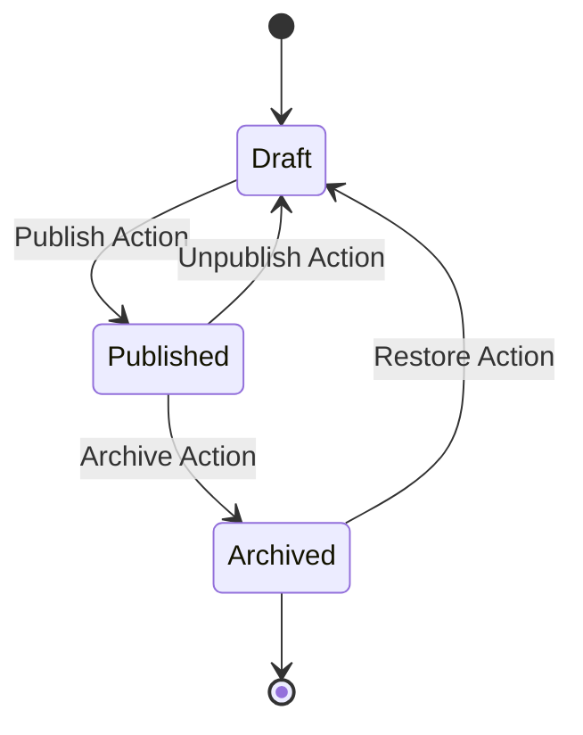

# System Architecture

**Feature**: Member Portal Platform MVP

## Technology Stack

### Frontend
- **Framework**: React 18+
- **Language**: TypeScript
- **Build Tool**: Vite
- **Styling**: CSS Modules or Tailwind (TBD during implementation, default to CSS Modules per existing structure).
- **State Management**: React Context + Hooks (Keep it simple).

### Backend
- **Runtime**: Node.js (LTS)
- **Framework**: Express.js
- **Language**: TypeScript
- **ORM**: Prisma or TypeORM (Prisma recommended for type safety).
- **Database**: MySQL 8.0+

### Infrastructure
- **Hosting**: Dockerized containers (assumed).
- **Storage**: Local filesystem or S3-compatible object storage for PDFs (Abstracted interface).

## Core Principles Implementation

### Backend Authority
- **Validation**: All inputs validated using `zod` or `joi` on the server.
- **Authorization**: Middleware checks `req.user.role` for every protected route.
- **Visibility**: Database queries explicitly filter by `status='published'` and `visibility` based on user role.

### Security Architecture

#### Authentication
- **Mechanism**: JWT Bearer token in Authorization: Bearer <token>.
- **Token Lifetime**: Short-lived token appropriate for MVP; re-authentication is acceptable when expired.
- **Password Storage**: `bcrypt` hashing.

#### Role-Based Access Control (RBAC)
- **Middleware**: `requireRole(['admin', 'staff'])`
- **Context**: User role embedded in session/token.

#### QR Security
- **Payload**: Signed JWT containing `ticketId` and `eventId`.
- **Signing**: Server-side secret key.
- **Anti-Replay**: Database flag `checked_in_at` checked transactionally.

## Content Lifecycle State Machine

## Bulk Processing Architecture

1.  **Upload**: Admin uploads ZIP.
2.  **Extraction**: Server extracts to temporary storage.
3.  **Processing Loop**:
    - Iterate through files.
    - Parse filename -> Month/Year period + Building/Cluster/Unit identifier.
    - Lookup `Member` by `UnitID`.
    - **Transaction**:
        - Save PDF to permanent storage.
        - Create/Update `BillingStatement` record.
    - Catch errors, add to `Report`.
4.  **Cleanup**: Delete temp files.
5.  **Response**: Return JSON report.

## Data Flow

### Event Check-in
1.  **Staff App** scans QR.
2.  **Request**: `POST /api/staff/check-in { ticketToken, eventId }`
3.  **Server**:
    - Verify Token Signature.
    - Decode `ticketId` and `eventId` from the signed payload (or resolve via lookup), then verify request eventId matches ticket eventId.
    - **DB Transaction**:
        - `SELECT * FROM Ticket WHERE id = ? FOR UPDATE`
        - Confirm the event is within the scanning window: start_at - 3h through end_at + 3h (if end_at is null, treat end_at = start_at for scanning window calculations).
        - Check `checkedInAt` is NULL.
        - `UPDATE Ticket SET checkedInAt = NOW()`
4.  **Response**: Success/Failure + Member Name (for verification).
