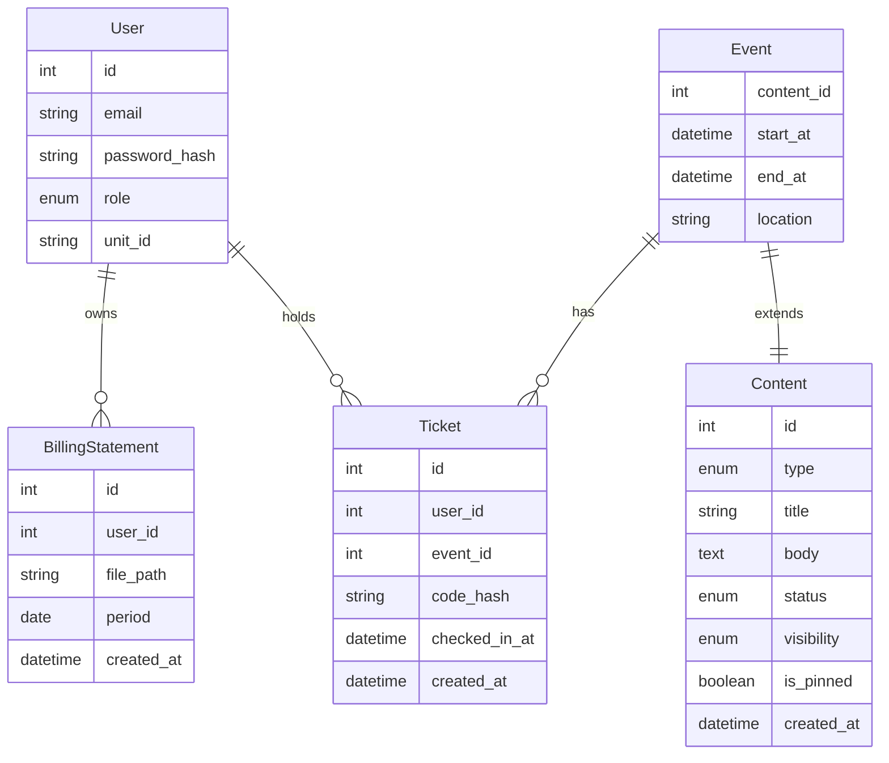

# Data Model

**Feature**: Member Portal Platform MVP

## Entity Relationship Diagram (Conceptual)

## Schema Definitions

### 1. Users
| Field | Type | Constraints | Description |
|-------|------|-------------|-------------|
| `id` | UUID/Int | PK | Unique Identifier |
| `email` | String | Unique, Not Null | Login credential |
| `password_hash` | String | Not Null | Bcrypt hash |
| `role` | Enum | `MEMBER`, `ADMIN`, `STAFF` | Access level. Guest is not persisted; it is the absence of authentication. |
| `unit_id` | String | Optional | For billing association |
| `status` | Enum | `ACTIVE`, `SUSPENDED`, `INVITED` | Account status |

### 1b. Invites
| Field | Type | Constraints | Description |
|-------|------|-------------|-------------|
| `id` | UUID/Int | PK | |
| `email` | String | Not Null | Email invited |
| `role` | Enum | `MEMBER`, `STAFF`, `ADMIN` | Intended role |
| `unit_id` | String | Nullable | Optional association |
| `token_hash` | String | Not Null | Hash of invite token |
| `expires_at` | DateTime | Not Null | Expiry |
| `used_at` | DateTime | Nullable | Set when accepted |
| `created_by` | User FK | Not Null | Admin issuer |
| `created_at` | DateTime | Not Null | Audit |

### 2. Content
| Field | Type | Constraints | Description |
|-------|------|-------------|-------------|
| `id` | Int | PK | |
| `type` | Enum | `ANNOUNCEMENT`, `ACTIVITY`, `MEMO`, `EVENT` | Discriminator |
| `title` | String | Not Null | |
| `body` | Text | | Markdown or HTML content |
| `status` | Enum | `DRAFT`, `PUBLISHED`, `ARCHIVED` | Lifecycle state |
| `visibility` | Enum | `PUBLIC`, `MEMBER` | Access control |
| `is_pinned` | Boolean | Default False | Sorting priority |
| `published_at` | DateTime | | For sorting |

### 3. Events (Extension of Content)
*Ideally implemented as a separate table linked by `content_id` or single table inheritance.*

| Field | Type | Constraints | Description |
|-------|------|-------------|-------------|
| `content_id` | Int | FK, PK | Link to Content |
| `start_at` | DateTime | Not Null | Event start |
| `end_at` | DateTime | Nullable | Event end |
| `location` | String | Nullable | Physical location |

### 4. Tickets
| Field | Type | Constraints | Description |
|-------|------|-------------|-------------|
| `id` | UUID | PK | Public ID for QR |
| `event_id` | Int | FK | |
| `user_id` | Int | FK | Owner |
| `issued_at` | DateTime | Not Null | |
| `checked_in_at` | DateTime | Nullable | If set, ticket is used |
| `voided_at` | DateTime | Nullable | If set, ticket is invalid |
| `qr_jti` | String | Optional | Unique token id for revocation |

### 5. BillingStatements
| Field | Type | Constraints | Description |
|-------|------|-------------|-------------|
| `id` | Int | PK | |
| `user_id` | Int | FK | |
| `file_path` | String | Not Null | Path to storage |
| `period` | Date | Not Null | First day of month (e.g. 2023-01-01) |
| `created_at` | DateTime | | Audit |

## Enums

### Role
- `MEMBER`: Authenticated, read-only.
- `ADMIN`: Full system control.
- `STAFF`: Event scanning only.
- Guest is not a stored role; guest access applies to unauthenticated requests.

### ContentType
- `ANNOUNCEMENT`
- `ACTIVITY`
- `MEMO`
- `EVENT`

### ContentStatus
- `DRAFT`
- `PUBLISHED`
- `ARCHIVED`

### ContentVisibility
- `PUBLIC`
- `MEMBER`
